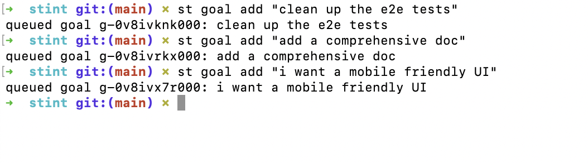
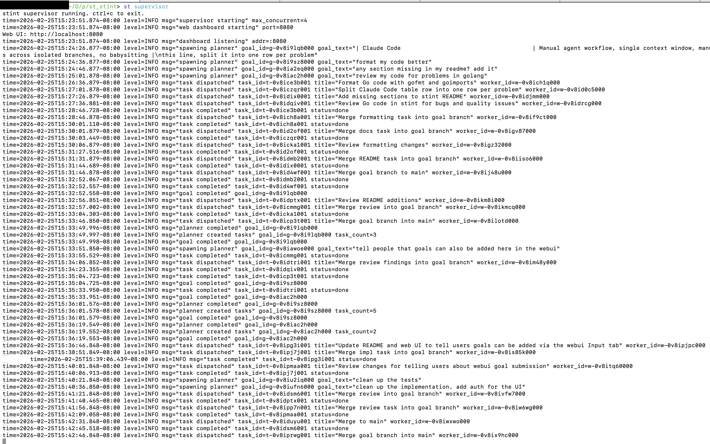
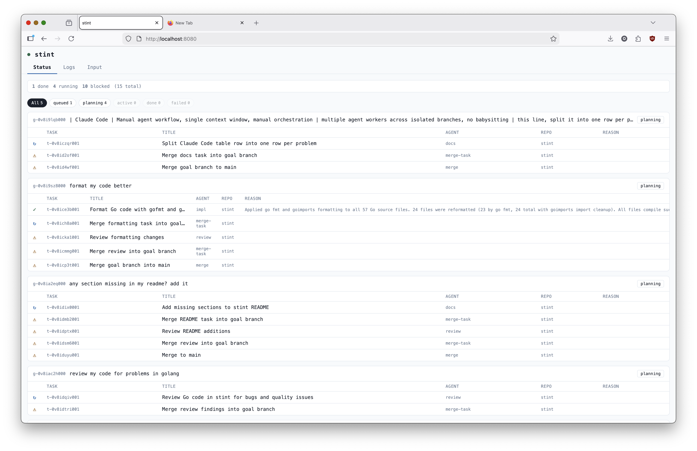
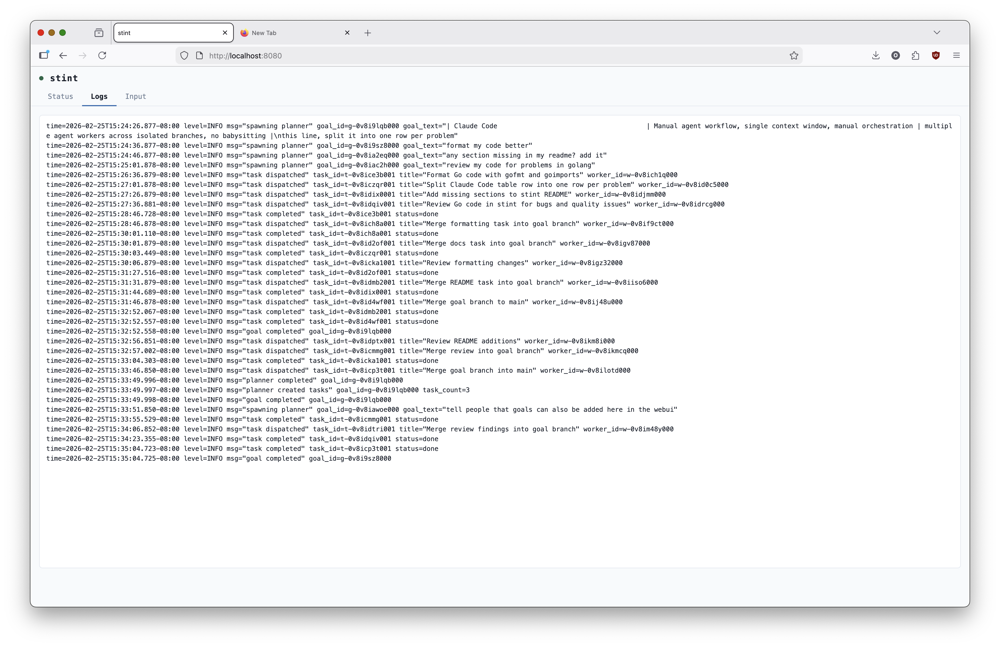
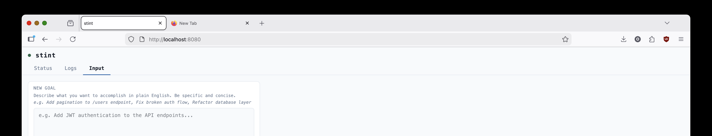
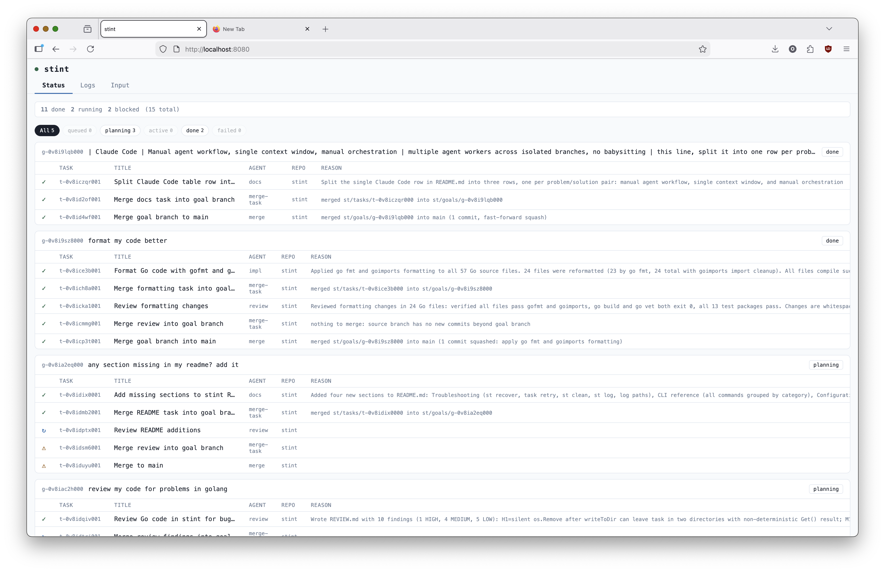
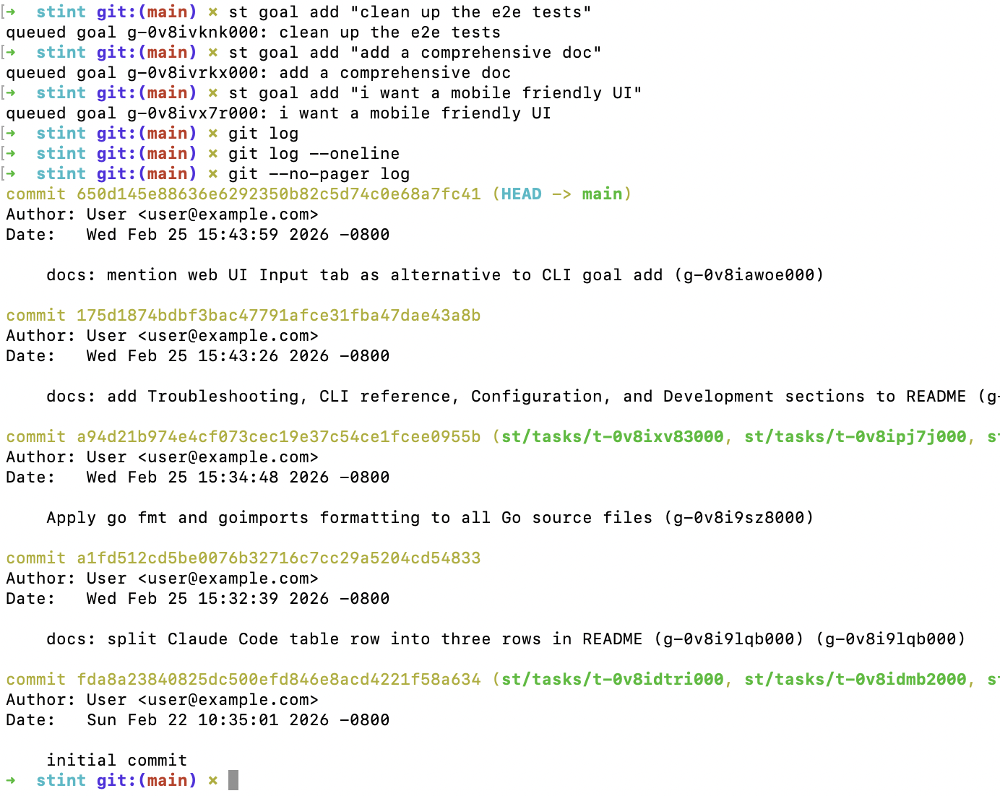

# stint

Simple multi-agent orchestration for Claude Code. 

## What Problem Does This Solve?


| Tool                                             | Drawbacks                                                          | Stint does it better by…                                        |
|--------------------------------------------------|--------------------------------------------------------------------|-----------------------------------------------------------------|
| [Gastown](https://github.com/steveyegge/gastown) | Complicated setup, difficult to get working                        | Simple to use and simple to understand                          |
| OpenClaw                                         | Requires constant LLM interaction to monitor work                  | Fire-and-forget — walk away, get results                        |
| Claude Code                                      | Each Claude Code session is just one session in a terminal                                              | Multiple agent workers across isolated branches and worktrees                 |
| Claude Code                                      | Single context window                                              | Each worker has its own isolated context window |
| Claude Code                                      | Manual orchestration and supervision                                              | Automated planner and supervisor handle all task planning and scheduling     |

With Stint, you tell it goals and walk away. You come back and find the commits ready.

## Principles

Simple. It is simple to use and simple to understand. 
Durable. Stint just works and you will not need to babysit it. 
We don't reinvent the wheels. There is no complex system for issue tracking or orchestration because there is no need. 

## Prerequisites

- Go 1.21+
- [Claude CLI](https://github.com/anthropics/claude-code) installed and on your PATH (`claude`)
- Git

## Install

```bash
go install ./cmd/st/
```

`go install` places the binary in `$(go env GOPATH)/bin`. Make sure that directory is on your PATH:

```bash
# Add to ~/.zshrc or ~/.bashrc
export PATH="$(go env GOPATH)/bin:$PATH"
```

Then reload your shell (`source ~/.zshrc`) and `st` will be available anywhere.

## Quick start

```bash
# 1. Create a workspace (separate directory from your code)
st init ~/my-workspace --repo myapp=/path/to/my-repo
cd ~/my-workspace

# 2. Queue a goal
st goal add "Add pagination to the /users API endpoint" --repos myapp
# Or open http://localhost:8080 and click the Input tab to submit goals from the web UI.

# 3. Start the supervisor (handles all goals, keeps running)
st supervisor

# 4. Check progress at http://localhost:8080
# Use the Input tab on the dashboard to add more goals without the CLI.
```


## Walkthrough

### Step 1 — Queue your goals

Use `st goal add` to queue one or more goals in natural language. You can queue as many as you want.




---

### Step 2 — Start the supervisor

Run `st supervisor` once in your workspace directory. 



The supervisor immediately begins planning each queued goal — you can see it spawning planners, creating tasks, and dispatching workers in real time. You can walk away at this point.

---

### Step 3 — Watch progress in the web dashboard

While the supervisor runs, open **http://localhost:8080**. 




---

### Step 4 — Follow the logs

Click the **Logs** tab to see structured output from the supervisor in real time.




---

### Step 5 — Submit new goals from the browser

The **Input** tab on the dashboard lets you type a goal and click **Submit Goal**.



---

### Step 6 — Watch goals complete





---

### Step 7 — Check the results in git

When goals complete, stint's workers have committed their work directly to your repo. 




---

## How it works

1. You submit any number of goals in natural language — they queue up and are processed in order.
2. The planner agent explores your repos and creates tasks with explicit dependencies.
3. For each task it selects an agent — choosing from the built-in set (`impl`, `test`, `debug`, `review`, `security`, `docs`, and others) plus any custom agents you've added to `.st/agents/` — defaulting to `impl` when no specialist is needed.
4. The supervisor fans those tasks out to parallel Claude worker processes — each running in its own git worktree on its own branch — up to `--max-concurrent` workers at a time (default 4).
5. Merge agents integrate the results back into main.

```
Goal
  │
  ▼
Planner (explores repos, creates tasks with deps)
  │
  ▼
Supervisor (dispatches tasks as deps are satisfied)
  │           │           │
[impl]     [test]     [review]    ← parallel workers, isolated branches
  │
  ▼
merge agent (goal branch → main)
```

## Core concepts

**Workspace** — a directory holding all state: goals, tasks, agents, logs, and git worktrees. Identified by a `.st/workspace.json` file; all data lives under `.st/`.

**Goal** — a natural-language objective (e.g. "migrate all SQL queries to prepared statements"). The planner decomposes it into tasks.

**Task** — the atomic unit of work. One Claude process, one git worktree, one branch. Tasks can depend on other tasks and receive their summaries and diffs as context.

**Agent** — an agent defined as a Markdown file in Claude agent format. Controls the system prompt, allowed tools, model, and permission mode.

**Supervisor** — the dispatch daemon. Polls for pending tasks, spawns worker processes, monitors heartbeats, and runs recovery on stale workers.

## Custom agents

```bash
st agent create docs \
  --prompt "You are a technical writer. Write clear docstrings and README updates." \
  --tools "Read, Write, Edit, Glob, Grep, LS"
```

Agents are Markdown files with YAML frontmatter in `.st/agents/<name>.md`. See [docs/design.md](docs/design.md) for the full frontmatter field reference.

## Configuration

### `st supervisor` flags

| Flag | Default | Description |
|---|---|---|
| `--max-concurrent` | `4` | Maximum number of parallel worker processes |
| `--port` | `8080` | Web dashboard port (`0` disables the dashboard) |
| `--random-port` | — | Pick a random free OS port for the web dashboard |

The same `--max-concurrent`, `--port`, and `--random-port` flags are also accepted by `st run`.

### Environment variables

| Variable | Description |
|---|---|
| `ST_WORKSPACE` | Path to the workspace. Fallback when `.st.json` is not found by walking up from the current directory. Workers and planners inherit this automatically. |

### Model selection

Model is configured per-agent in the agent frontmatter (`model: sonnet|opus|haiku|inherit`). All built-in agents default to `inherit`, which uses whatever model Claude defaults to. Override per-agent with `st agent create --model <model>` or by editing `.st/agents/<name>.md` directly.

---

## Development

### Build from source

```bash
go install ./cmd/st/
```

### Run tests

Fast unit and CLI tests (no network, no Claude required):

```bash
go test ./...
```

Full end-to-end tests (requires Claude CLI, takes up to 30 minutes):

```bash
go test -v -tags e2e -timeout 30m ./e2e/
```

See [e2e/README.md](e2e/README.md) for prerequisites and how to run specific e2e scenarios.